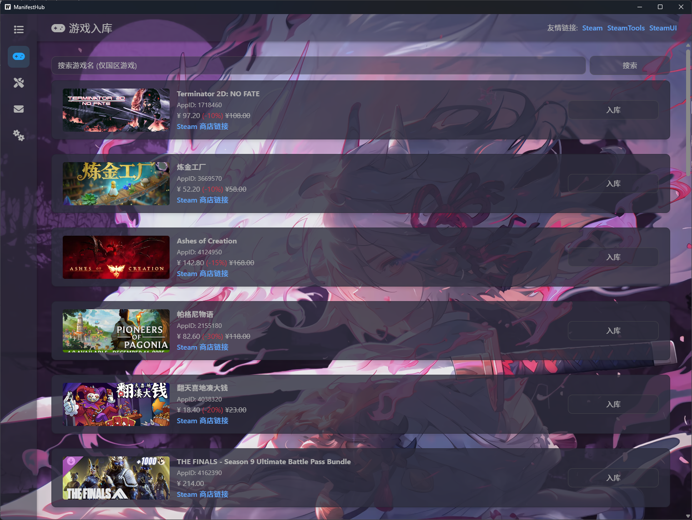

<h1 align="center">ManifestHub GUI</h1>

    
    
    

一个基于 Golang & Wails 开发的提取 Steam 密钥工具

## 说明

技术栈:
- Wails 2.X
- Go 1.25+

后端依赖库:
- Viper 1.21.0
- Wails 2.11.0
- sreq 0.9.11
- sys 0.38.0

支持平台:
- Windows 10 1809+

软件数据:
- 日志文件: `%AppData%/ManifestHub GUI/Log`
- 配置文件: `%AppData%/ManifestHub GUI/Config`
- 缓存文件: `%AppData%/程序名.exe`

未来路线发展: <a href="./doc/markdown/future.md">future.md</a>
开发文档: <a href="./doc/markdown/developer.md">developer.md</a>

## 用户界面

## 开源协议
本项目基于 <a href="https://github.com/SLSYSL/ManifestHub-GUI/blob/master/LICENSE">MIT License</a> 许可证发行